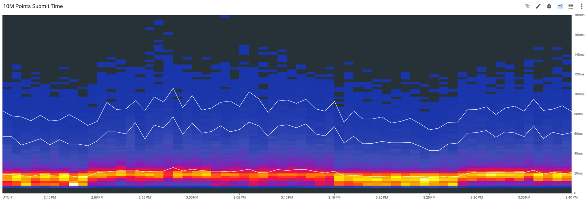

# GCP Metrics

A Java library for emitting metrics to GCP.

Can run in the Dataflow runner, as metric objects are serializable and lazily loaded.

Can handle large volumes of points in distribution metrics, and large numbers of counter
updates. Here is a histogram of the time it takes to publish 10 million random points to a
distribution each second from 100 threads sending 100 thousand points each in parallel.

That time also includes a counter being updated 100 million times by the same threads.

